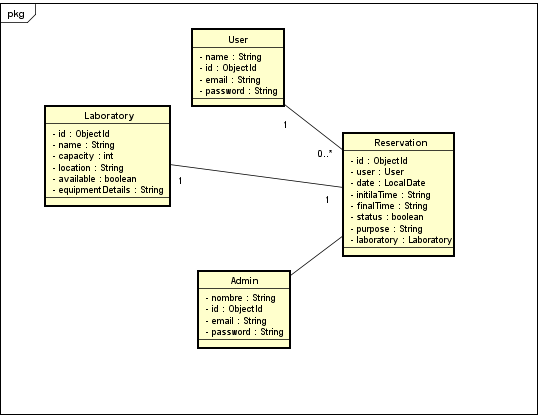
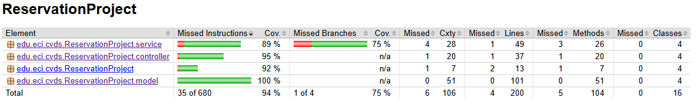

# PROYECTO_CVDS_BACK

El proyecto consiste en una aplicación para la gestión de reservas de laboratorios dentro Ingeniería de Sistemas de la Escuela Colombiana de Ingeniería Julio Garavito. Los usuarios podrán consultar la disponibilidad de laboratorios, realizar reservas y cancelar sus reservas desde una interfaz web. La aplicación se conectará a un API REST desarrollado en Spring Boot. El backend permitirá la inyección de dependencias para el manejo de datos, pudiendo optar entre una base de datos en MongoDB Cloud o un archivo de texto plano para almacenar las reservas.

Análisis estático de código

Link del proyecto en azure:

[AzureDevOps Project](https://dev.azure.com/JuanJoseDiazGomez/CVDS_ReservationProject)
